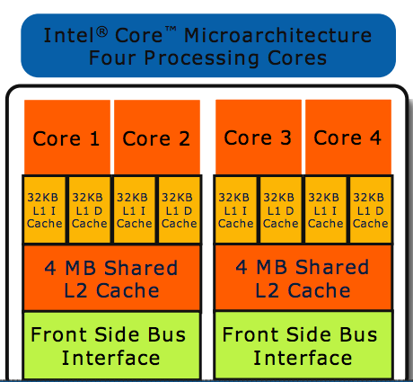
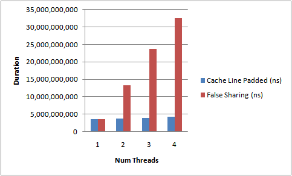
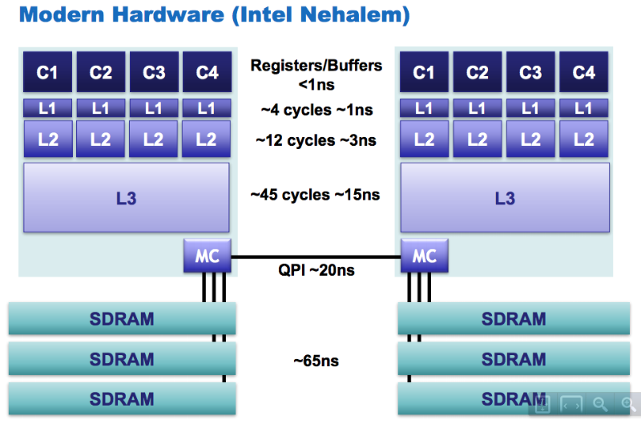

!!EXPLAIN
微架构之x86

`x86`是一个指令集架构家族，最早由英特尔在`Intel 8086` CPU上开发出来。该系列较早期的处理器名称是以数字来表示`80x86`。由于以`86`作为结尾，包括`Intel 8086`、`80186`、`80286`、`80386`以及`80486`，因此其架构被称为`x86`。

!!#x86x64# 发展历程

`x86`架构于`1978年`推出的`Intel 8086`中央处理器中首度出现，它是从`Intel 8008`处理器中发展而来的，而`8008`则是发展自`Intel 4004`的。`8086`在三年后为`IBM PC`所选用，之后x86便成为了个人计算机的标准平台，成为了历来最成功的CPU架构。

`8086`是`16位`处理器；直到`1985年` `32位`的`80386`的开发，这个架构都维持是`16位`。接着一系列的处理器表示了`32位`架构的细微改进，推出了数种的扩充，直到`2003年` `AMD`对于这个架构发展了`64位`的扩充，并命名为`AMD64`。后来英特尔也推出了与之兼容的处理器，并命名为`Intel 64`。两者一般被统称为`x86-64`或`x64`，开创了`x86`的`64位`时代。

_英特尔在`1990年代`就与惠普合作提出了一种用在安腾系列处理器中的独立的`64位`架构，这种架构被称为`IA-64`。`IA-64`是一种崭新的系统，和x86架构完全没有相似性；不应该把它与`x86-64`或`x64`弄混。_

!!#cache# CPU缓存

#### `Core 2` `L1 Cache`(容量`32K`，`8路`，缓存线`64字节`):

_图片引用自：[!](http://duartes.org/gustavo/blog/post/intel-cpu-caches)_

 
#### 高速缓存`L1`,`L2`及`L3`的结构：

 
#### 在`Linux`下查看高速缓存的信息：
%%% wikiTable class=table___table-bordered style=width:800px;
||*2 `cat /sys/devices/system/cpu/cpu{N}/cache/index{N}/{?}` |
|| level | `1`,`2`,`3` 分别代表 `L1`,`L2`,`L3` |
|| type | `Data`或`Instruction`，只有`L1`才有`Instruction` |
|| coherency_line_size | `缓存线`(`Cache Line`)大小 |
|| number_of_sets | 是多少行 |
|| ways_of_associativity | 一共有多少路 |
|| size | `32K`缓存大小 (`== coherency_line_size * number_of_sets * ways_of_associativity`) |
|| shared_cpu_list | 在哪几个“`CPU`”之间共享，逗号分隔方式枚举 |
|| shared_cpu_map | 在哪几个“`CPU`”之间共享，十六进制表示 |
%%%

!!#mesi# 缓存一致性

在`x86`微架构下，高速缓存是保证一致性的，即只要程序读写内存地址即可保证一定是读到的最新值，且写入的值可被读到。这种一致性通过缓存一致性协议实现。

缓存一致性(`MESI`, `Modified Exclusive Shared Invalid`)协议，也称为伊利诺伊协议(`Illinois protocol`，由伊利诺伊大学香槟[`Urbana-Champaign`]分校开发)，被广泛用于缓存一致性和内存一致性。是支持缓存回写的最通用的一种协议。

在`MESI`协议中，每个缓存行有4个状态，可用2个bit表示，它们分别是：

%%% wikiTable class=table___table-bordered style=width:700px;
|| 状态 || 描述 ||
|| M(Modified) | 这行数据有效，数据被修改了，和内存中的数据不一致，数据只存在于本`Cache`中。 |
|| E(Exclusive) | 这行数据有效，数据和内存中的数据一致，数据只存在于本`Cache`中。 |
|| S(Shared) | 这行数据有效，数据和内存中的数据一致，数据存在于很多`Cache`中。 |
|| I(Invalid) | 这行数据无效 |
%%%

`MESI`状态迁移图：

_其中`Intel`使用[!`MESIF`](http://en.wikipedia.org/wiki/MESIF_protocol)，`AMD`使用[!`MOESI`](http://en.wikipedia.org/wiki/MOESI_protocol)_

!!#falsesharing# 伪共享:::伪共享(False Sharing)

`伪共享`是在多核CPU下才会出现的一种特殊的竞争访问内存的情况，即当两个在一个缓存线中的变量在被两个线程频繁修改的时候会出现大量`L1`, `L1 L2`或`L1 L2 L3`缓存失效。

#### 伪共享原理介绍：

#### 测试伪共享的代码：
%%% prettify ln=1
public final class FalseSharing
    implements Runnable
{
    public final static int NUM_THREADS = 4; // change
    public final static long ITERATIONS = 500L * 1000L * 1000L;
    private final int arrayIndex;
 
    private static VolatileLong[] longs = new VolatileLong[NUM_THREADS];
    static
    {
        for (int i = 0; i < longs.length; i++)
        {
            longs[i] = new VolatileLong();
        }
    }
 
    public FalseSharing(final int arrayIndex)
    {
        this.arrayIndex = arrayIndex;
    }
 
    public static void main(final String[] args) throws Exception
    {
        final long start = System.nanoTime();
        runTest();
        System.out.println("duration = " + (System.nanoTime() - start));
    }
 
    private static void runTest() throws InterruptedException
    {
        Thread[] threads = new Thread[NUM_THREADS];
 
        for (int i = 0; i < threads.length; i++)
        {
            threads[i] = new Thread(new FalseSharing(i));
        }
 
        for (Thread t : threads)
        {
            t.start();
        }
 
        for (Thread t : threads)
        {
            t.join();
        }
    }
 
    public void run()
    {
        long i = ITERATIONS + 1;
        while (0 != --i)
        {
            longs[arrayIndex].value = i;
        }
    }
 
    public final static class VolatileLong
    {
        public volatile long value = 0L;
        public long p1, p2, p3, p4, p5, p6; // comment out
    }
}
%%%

#### 伪共享是否做padding的测试结果：

 
图片及代码引用自：[!](http://mechanical-sympathy.blogspot.com/2011/07/false-sharing.html)

!!#reordering# 指令重排

我们知道现代CPU的主频越来越高，与cache的交互次数也越来越多。当CPU的计算速度远远超过访问cache时，会产生cache wait，过多的cache  wait就会造成性能瓶颈。
针对这种情况，多数架构（包括X86）采用了一种将cache分片的解决方案，即将一块cache划分成互不关联地多个 slots (逻辑存储单元，又名 Memory Bank 或 Cache Bank)，CPU可以自行选择在多个idle bank中进行存取。这种SMP的设计，显著提高了CPU的并行处理能力，也回避了cache访问瓶颈。

##### Memory Bank的划分：
* 一般 Memory bank 是按cache address来划分的。比如 偶数adress 0×12345000 分到 bank 0, 奇数address 0×12345100 分到 bank1。

##### 重排序的种类：
* 编译期重排：编译源代码时，编译器依据对上下文的分析，对指令进行重排序，以之更适合于CPU的并行执行。
* 运行期重排：CPU在执行过程中，动态分析依赖部件的效能，对指令做重排序优化。

##### 多处理器(含多核和超线程)系统中的指令重排遵循以下规则：
* Individual processors use the same ordering principles as in a single-processor system.
* Writes by a single processor are observed in the same order by all processors.
* Writes from an individual processor are NOT ordered with respect to the writes from other processors.
* Memory ordering obeys causality (memory ordering respects transitive visibility).
* Any two stores are seen in a consistent order by processors other than those performing the stores
* Locked instructions have a total order.

_`x86`指令重排详见：`8.2 MEMORY ORDERING`: [!Intel® 64 and IA-32 Architectures Software Developer’s Manual, Volume 3A: System Programming Guide, Part 1](http://www.intel.com/content/dam/www/public/us/en/documents/manuals/64-ia-32-architectures-software-developer-vol-3a-part-1-manual.pdf)_

!!#accessperformance# CPU访问相关性能

[!](intel_nehalem.png)

