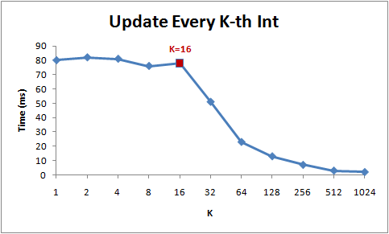

!!EXPLAIN
代码分析

对于Java内存模型主要就是多线程编程下面是否功能正常工作，所以我们这里看看几段代码吧。

!!#sample1# Sample 1

#### 源代码：

%%% prettify ln=1
public class Sample {
  private static int count = 0;
  
  public static void increment() {
    count++;
  }
}
%%%

这个代码线程安全么？为什么？

!!#sample2# Sample 2

#### 源代码：

%%% prettify ln=1
// 代码1
public class Sample {
  private static int count = 0;
  
  synchronized public static void increment() {
    count++;
  }
}
  
// 代码2
public class Sample {
  private static AtomicInteger count = new AtomicInteger(0);
  
  public static void increment() {
    count.getAndIncrement();
  }
}
%%%

上面两段代码其实也是悲观锁和乐观锁的盒子，`synchronized`需要先取得锁，而`getAndIncrement`则使用`lock cmpxchg`或`lock xadd`完成，当使用`lock cmpxchg`则相当于乐观锁，最后`lock xadd`相当于在更新数据库的时候直接执行`update set value=value+1 where id=?`。

!!#sample3# Sample 3

#### 源代码：

%%% prettify ln=1
public class CacheTest {

    public static void main(String[] args) {
        int[] arr = new int[64 * 1024 * 1024];
        for (int _loop = 0; _loop < 10; _loop++) {
            System.out.print("Round: " + _loop);
            {
                long s = System.currentTimeMillis();
                for (int i = 0; i < arr.length; i++) {
                    arr[i] *= 3;
                }
                System.out.print("\t" + (System.currentTimeMillis() - s) + " ms");
            }
            {
                long s = System.currentTimeMillis();
                for (int i = 0; i < arr.length; i += 8) {
                    arr[i] *= 3;
                }
                System.out.print("\t" + (System.currentTimeMillis() - s) + " ms");
            }
            {
                long s = System.currentTimeMillis();
                for (int i = 0; i < arr.length; i += 16) {
                    arr[i] *= 3;
                }
                System.out.print("\t" + (System.currentTimeMillis() - s) + " ms");
            }
            {
                long s = System.currentTimeMillis();
                for (int i = 0; i < arr.length; i += 32) {
                    arr[i] *= 3;
                }
                System.out.print("\t" + (System.currentTimeMillis() - s) + " ms");
            }
            System.out.println();
        }
    }
}
%%%

#### 测试结果如下：

从下面的结果可以看到只有到了第4列消耗的时间大幅减少(测试数据在我的MBP上得到)。为什么呢？

%%% prettify ln=1
Round: 0  164 ms  135 ms  132 ms  90 ms
Round: 1  169 ms  136 ms  147 ms  103 ms
Round: 2  140 ms  131 ms  131 ms  83 ms
Round: 3  141 ms  131 ms  133 ms  82 ms
Round: 4  165 ms  140 ms  134 ms  84 ms
Round: 5  172 ms  135 ms  129 ms  89 ms
Round: 6  143 ms  149 ms  129 ms  93 ms
Round: 7  140 ms  136 ms  130 ms  88 ms
Round: 8  137 ms  136 ms  129 ms  86 ms
Round: 9  137 ms  131 ms  132 ms  82 ms
%%%

#### K与响应时间的关系：

 
_图片及代码引用自：[!](http://igoro.com/archive/gallery-of-processor-cache-effects/)_

