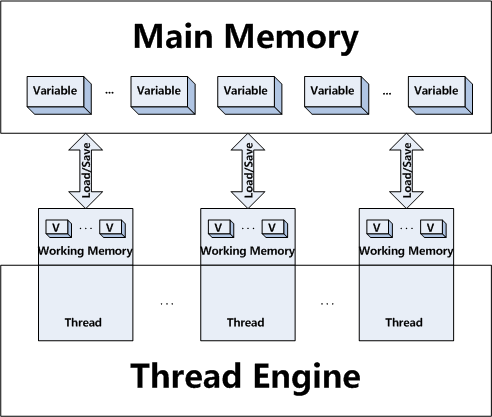

!!EXPLAIN
Java内存模型

我们先来看一段代码：

%%% prettify ln=1
final class SetCheck {
  private int  a = 0;
  private long b = 0;

  void set() {
    a =  1;
    b = -1;
  }

  boolean check() {
    return ((b ==  0) ||
            (b == -1 && a == 1)); 
  }
}
%%%

_代码引用自：[!](http://gee.cs.oswego.edu/dl/cpj/jmm.html)_

!!#mainmemandworkmem# 内存模型

### 原子性

Which instructions must have indivisible effects. For purposes of the model, these rules need to be stated only for simple reads and writes of memory cells representing fields - instance and static variables, also including array elements, but not including local variables inside methods.

### 可见性

Under what conditions the effects of one thread are visible to another. The effects of interest here are writes to fields, as seen via reads of those fields.

### 重排序

Under what conditions the effects of operations can appear out of order to any given thread. The main ordering issues surround reads and writes associated with sequences of assignment statements.

### happen-before

1. 同一个线程中的每个`Action`都`happens-before`于出现在其后的任何一个`Action`。
1. 对一个监视器的解锁`happens-before`于每一个后续对同一个监视器的加锁。
1. 对`volatile`字段的写入操作`happens-before`于每一个后续的同一个字段的读操作。
1. `Thread.start()`的调用会`happens-before`于启动线程里面的动作。
1. `Thread`中的所有动作都`happens-before`于其他线程检查到此线程结束或者`Thread.join()`中返回或者`Thread.isAlive()==false`。
1. 一个线程`A`调用另一个另一个线程B的`interrupt()`都`happens-before`于线程`A`发现`B`被`A`中断（`B`抛出异常或者`A`检测到`B`的`isInterrupted()`或者`interrupted()`）。
1. 一个对象构造函数的结束`happens-before`与该对象的`finalizer`的开始
1. 如果A动作`happens-before`于`B`动作，而B动作`happens-before`与`C`动作，那么`A`动作`happens-before`于`C`动作。

!!#final# final

!!#volatile# volatile

`volatile`关键词是告诉编译器说“这个变量是易变的，请保证始终读、写唯一的值，并且请保证原子性”，当编译器接收到这些信息后，编译器会做如下处理：

1. 禁止编译器本身对该变量的读、写缓存优化
1. 根据当前的微架构，在生成读、写该变量的硬件指令时禁止CPU的高速缓存
    * `X86`：微架构已经保证了缓存的强一致性，无须使用特别的指令
    * `IA64`：使用`ld.acq`或`st.rel`指令进行读、写，保证CPU的高速缓存被更新
1. 禁止对这个变量读写前后的指令重排
    * `X86`：`mfence` or `cpuid` or `locked insn` (`lock; addl $0,0(%%esp)`)
    * `IA64`：`mf`

In terms of atomicity, visibility, and ordering, declaring a field as volatile is nearly identical in effect to using a little fully synchronized class protecting only that field via get/set methods, as in:

%%% prettify ln=1
final class VFloat {
  private float value;

  final synchronized void  set(float f) { value = f; }
  final synchronized float get()        { return value; }
}
%%%

 
_代码引用自：http://gee.cs.oswego.edu/dl/cpj/jmm.html_

!!#synchronized# synchronized

`synchronized`的锁原理及优化详见：[!Study_Java_HotSpot_Concurrent](https://code.google.com/p/hatter-source-code/wiki/Study_Java_HotSpot_Concurrent)

!!#contended# @Contended

 `sun.misc.Contended`

`@Contended`通过[!JEP 142 (在特定字段上减少高速缓存竞争访问)](http://openjdk.java.net/jeps/142)引入，即针对伪共享提供一种解决方案，解决方法是通过`@Contended`来标记哪些字段是竞争访问的，编译器在编译的时候即将存在竞争访问的字段对齐到不同的缓存线。

Sample代码`jdk/src/share/classes/java/lang/Thread.java`：
%%% prettify
2034     // The following three initially uninitialized fields are exclusively
2035     // managed by class java.util.concurrent.ThreadLocalRandom. Additionally,
2036     // these fields are isolated from other fields in Thread due to being
2037     // heavily updated.
2038     /** The current seed for a ThreadLocalRandom */
2039     @sun.misc.Contended("tlr")
2040     long threadLocalRandomSeed;
2041     /** Probe hash value; nonzero if threadLocalRandomSeed initialized */
2042     @sun.misc.Contended("tlr")
2043     int threadLocalRandomProbe;
2044     /** Secondary seed isolated from public ThreadLocalRandom sequence */
2045     @sun.misc.Contended("tlr")
2046     int threadLocalRandomSecondarySeed;
%%%

