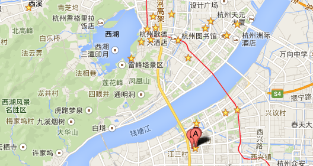

_招聘啦～～～_
==============

全球最大的`B2B`网站阿里巴巴国际站（网址：`http://www.alibaba.com/`，位置：`杭州滨江`）正在招聘`高级Java开发工程师`、`技术专家`。

## 高级Java开发工程师
1. 有技术热情，对`JVM`，`HTTP`有深入理解
1. 对JVM性能调优、故障诊断有一定经验
1. 对数据库（如`MySQL`，`Oracle`）有一定的基础
1. 对常见的网络安全有理解（如，`注入`,`XSS`,`CSRF`等）
1. 会基本的`HTML`、`JS`

## 技术专家
1. 有技术热情，对`JVM`，`HTTP`有深入理解
1. 对`JVM`性能调优、故障诊断有丰富经验并深入理解其原理
1. 对数据库原理有自己的理解
1. 有大型网站架构经验
1. 对网络安全有深入理解
1. 深入理解`HTML`、`JS`
1. 掌握一种非`Java`语言（如，`Ruby`、`Python`、`Go`等）优先

 
### _有意向者请发邮件到：[haitao.jianght@alibaba-inc.com](mailto:haitao.jianght@alibaba-inc.com)_

 
### 地理位置
[!](https://maps.google.com/maps?q=%E4%B8%AD%E5%9B%BD%E6%B5%99%E6%B1%9F%E6%9D%AD%E5%B7%9E%E6%BB%A8%E6%B1%9F%E5%8C%BA%E7%BD%91%E5%95%86%E8%B7%AF%E9%98%BF%E9%87%8C%E5%B7%B4%E5%B7%B4)

